# project-1

## Requirements
- [Anaconda](https://www.anaconda.com/products/individual)

## Installation
- Clone this repo
```
cd /path/to/project-1
conda create -n <your-env-name> python=3.9.5
conda activate <your-env-name>
pip install -r requirements.txt
streamlit run app.py
```

---

## Summary of Findings

This should include a heading for each question that was asked of your data, with a short description of what you found and any relevant plots under each heading.

The following analysis was performed using a chosen portfolio of [`BTC`, `ETH`, `SOL`] with weightings of [60, 20, 20] respectively.

### How has your portfolio performed in the past year?
This chart provides a graphical representation of daily returns for the selected cryptocurrencies.

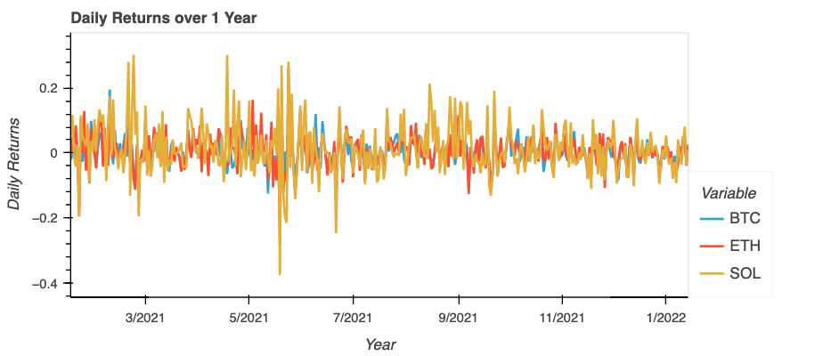

### How has your portfolio performed cumulatively in the past year?
Cumulative returns are calculated by adding the daily returns together to provide a graphical represenation of the total return of each cryptocurrency in the portfolio, for the past 12 months. 

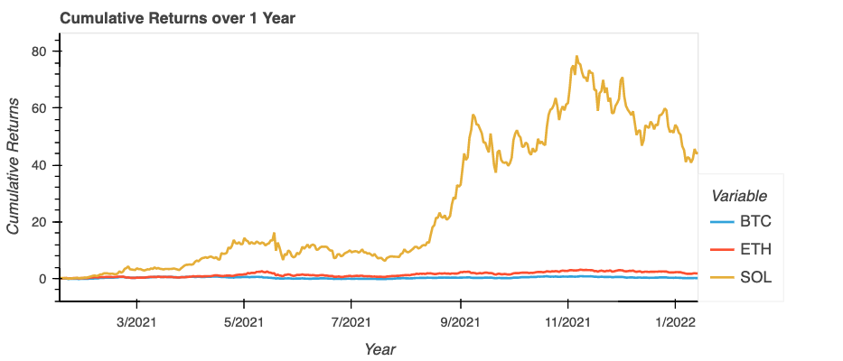

### How strongly correlated is your portfolio to BTC?
Beta is a measure of an assets volatiity relative to the market. In this case, we have compared the volatility to Bitcoin. The correlation is expressed as a positive or negative number between -1 and 1. The value of the number indicates the strength of the relationship: r = 0 means there is no correlation. r = 1 means there is perfect positive correlation. r = -1 means there is a perfect negative correlation. This charts plots the correltion of the selected portfolio to Bitcoin over the past 12 months. 

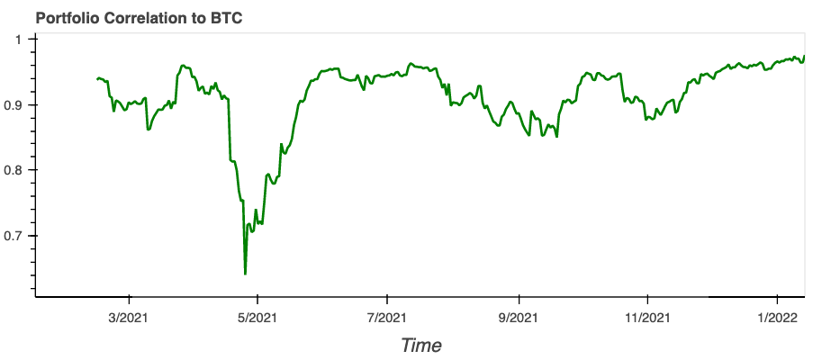

### How volatile is your portfolio?
The Beta plot shows the correlation of the portfolio to Bitcoin using a 30 day rolling average. 

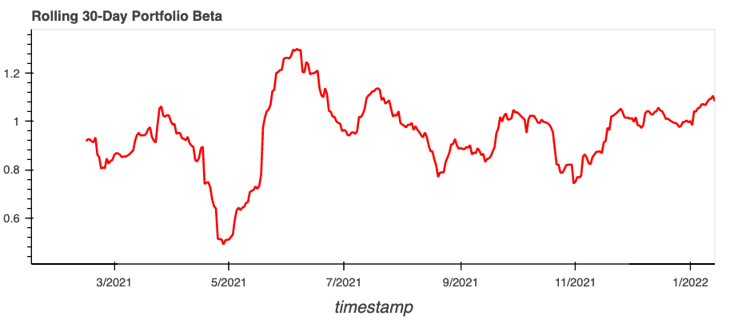

### How might your portfolio perform in one year?
A Monte Carlo Simulation constructs 100 probability distributions of the possible outcomes of the portfolio, based on the prior 12 months of historical data.

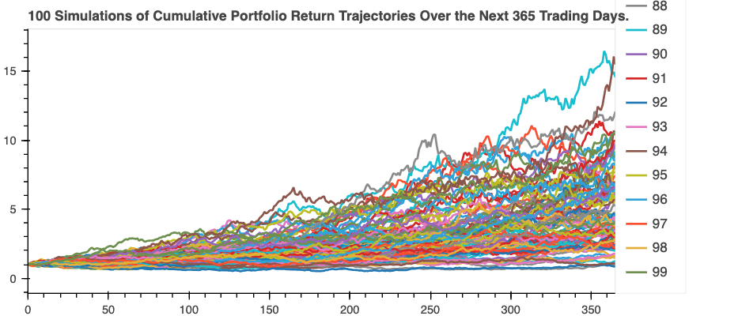

### What is the most probable expected portfolio return in one year?
The probability plot will provide an indication of the most likely outcome of the selected portfolio within a 95% confidence interval, which is 1 standard deviation. 
 
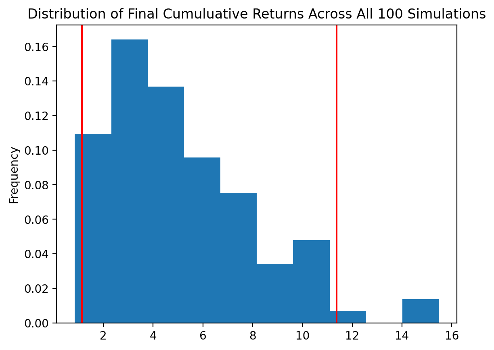

### Calculate the efficient frontier
The efficient frontier is the set of optimal portfolios that offer the highest expected return for a defined level of risk or the lowest risk for a given level of expected return.
Portfolios that lie below the efficient frontier are sub-optimal because they do not provide enough return for the level of risk.

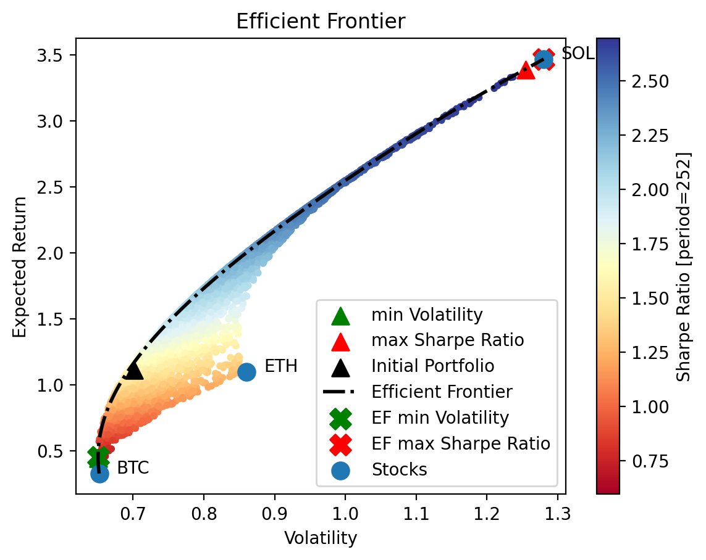

### Find the portfolio with the minimum volatility
The efficient portfolio weightings with the minimum volatility:
| Asset | Weighting (%) |
|-------|---------------|
| BTC   | 95.2          |
| SOL   | 3.25          |
| ETH   | 1.56          |

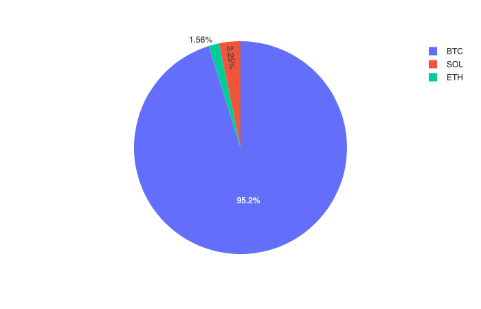

### Find the portfolio with the maximum Sharpe Ratio, also called the tangency portfolio
The efficient portfolio weightings with the maximum Sharpe Ratio:
| Asset | Weighting (%) |
|-------|---------------|
| SOL   | 97.4          |
| BTC   | 2.46          |
| ETH   | 0.191         |

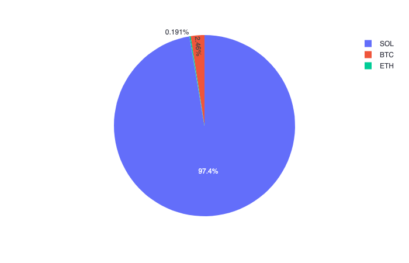

### Given a target volatility of 0.85, find the portfolio with the maximum Sharpe Ratio
The efficient portfolio weightings with a target volatility of 0.85 are:
| Asset | Weighting (%) |
|-------|---------------|
| SOL   | 49            |
| BTC   | 39.1          |
| ETH   | 12            |

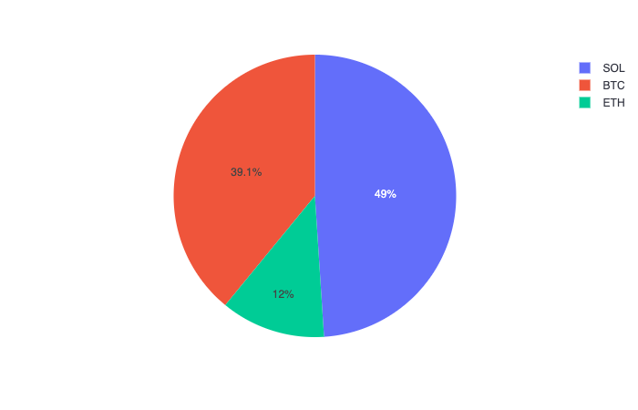

### Given an expected return of 1.5, find the portfolio with the minimum volatility
The efficient portfolio weightings with an expected return of 1.5 are:
| Asset | Weighting (%) |
|-------|---------------|
| BTC   | 58.4          |
| SOL   | 36            |
| ETH   | 5.64          |

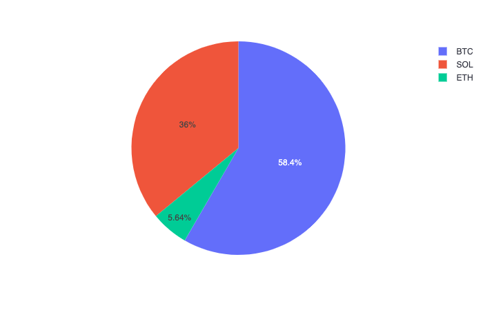
